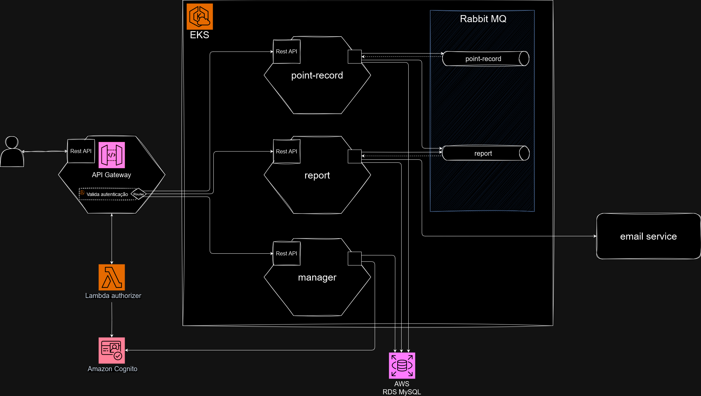
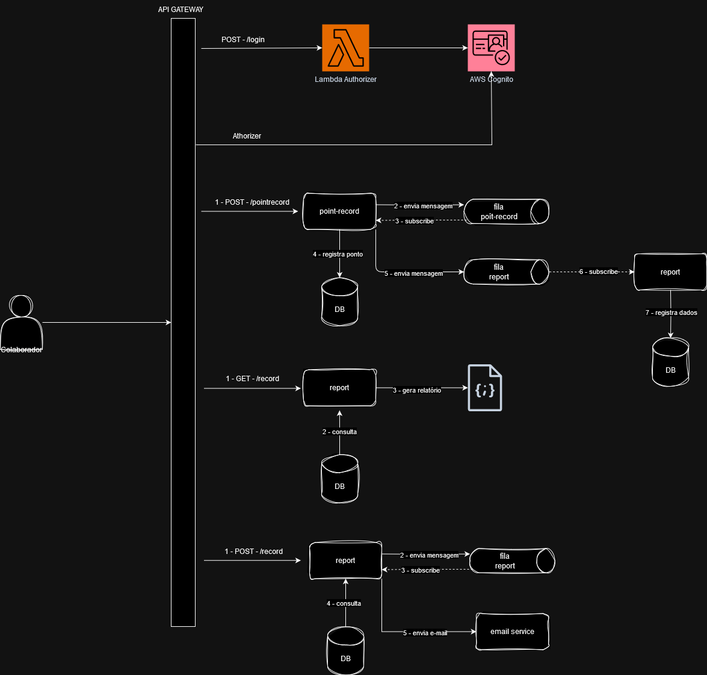
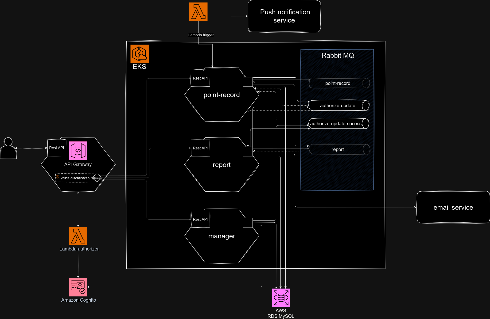
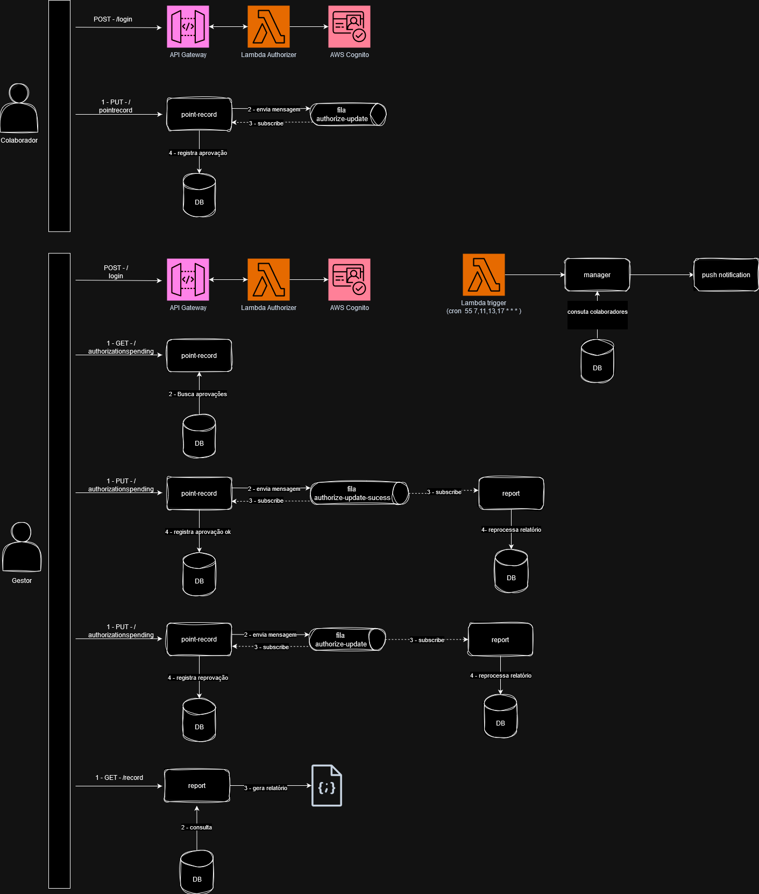

# Hackathon postech SOAT 1 - Grupo 17
Projeto desenvolvido para o Hackathon da pós graduação em arquitetura de software da fiap

Turma SOAT 1 - Grupo 17 
## Integrantes
RM349276 - Guilherme de Araújo do Nascimento

RM348571 - João Eduardo Ferreira de Lima

RM349239 - Vinicius Guimarães

## Fase 1
### Infra

### arquitetura

## Fase 2 
### Infra

### Arquitetura
